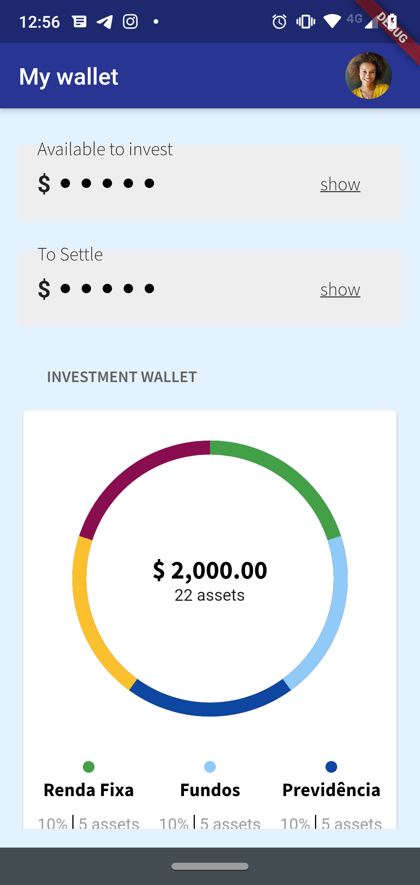

# Wallet
Carteira de investimentos em flutter

## Funcionalidades:

* Gráfico de investimento em carteira.
* Saldos na tela com função de esconder valores.
* Lista de dados de posição consolidada.
* Gráfico de rentabilidade de carteira.

## Linguagem 

* Dart.

## Framework

 * Flutter.
 
 ### Requisitos
 
 Passos de instalação e configuração voce encontra aqui:
 * [Flutter](https://flutter.dev/docs/get-started/install)

 ### Se tudo der certo, ao acessar você deve ver a seguinte tela:

